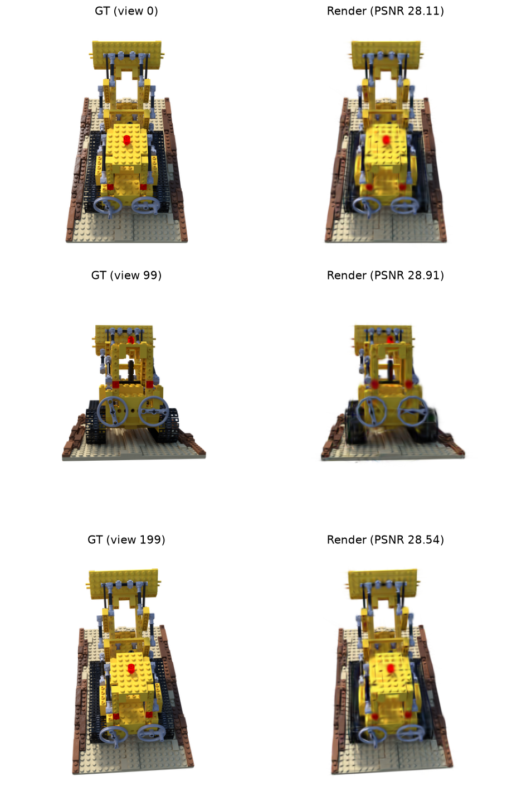

# 3DGS-PyTorch

A pure-PyTorch implementation of [3D Gaussian Splatting](https://repo-sam.inria.fr/fungraph/3d-gaussian-splatting/), written end-to-end for learning rather than production. **There is no custom CUDA kernel — the rasterizer, including alpha compositing and gradient flow, is expressed entirely as PyTorch tensor ops. The repo does NOT implement tile-based rasterization.** In addition, I sticked to random init for the synthetic NeRF dataset, following the setup in Table 2 of the paper.

This trades a significant amount of speed for being readable. The full pipeline (projection, EWA filter, SH evaluation, alpha compositing, adaptive control) lives in <500 lines of Python. The implementation is to strengthen my understanding and for anyone who wants to learn 3DGS without jumping right into CUDA kernel.

## Layout

```
3dgs-pytorch/
├── src/gs/             # library code
│   ├── gaussian.py     # GaussianModel, projection, EWA filter
│   ├── rasterizer.py   # chunked vectorized rasterizer with gradient checkpointing
│   ├── dataset.py      # NeRF-synthetic (Blender) data loader, camera class
│   ├── sh.py           # spherical harmonics evaluation
│   ├── control.py      # densification, splitting, cloning, pruning, opacity reset
│   ├── train.py        # one training step (forward, loss, backward)
│   ├── evaluate.py     # PSNR / SSIM on a held-out split
│   └── utils.py        # quaternion math, inverse sigmoid
├── configs/            # YAML training presets (paper / cloud_medium / colab_mini)
├── main.py             # training entry point (takes --config)
├── inference.py        # render a small test-view gallery from a checkpoint
├── imgs/               # rendered galleries used in this README
├── pyproject.toml
└── scripts/            # data download helpers
```

## Disclaimer
`Dataset.py,` `inference.py`, and the logging part inside `main.py` are implemented by Claude. In addition, the chunking approach for efficiency improvement inside `rasterizer.py` is implemented by Claude. And one should be cautious about other parts as well, as I may have had misunderstandings or made mistakes.

## Notes
I put a more detailed learning note of mine under `docs/tutorial.md`.

## Quick Try
For a quick experiment with the repo, one could run a mini scene with this [Google Colab notebook](https://colab.research.google.com/drive/1afE6YQLH5EMxTIrmvuavuroxHuBlMnzk?usp=sharing). The notebook does all the setup and build a highly downsampled LEGO scene (200x200) for (relatively) quick training and evaluation. Just choose a GPU backend and run everything.

## Setup

Requires CUDA-capable GPU and linux OS (Windows should work but the bash script needs modifications. So I recommend installing `wsl` to use the linux subsystem). [uv](https://docs.astral.sh/uv/) handles everything else.
1. **Install `uv`**:
   `curl -LsSf https://astral.sh/uv/install.sh | sh`
2. **Clone repo and sync**:
```bash
git clone https://github.com/<you>/3dgs-pytorch.git
cd 3dgs-pytorch
uv sync
```

`uv sync` installs PyTorch (cu124 wheel), the library deps, and registers `src/gs` as an editable
install so `from gs.gaussian import GaussianModel` works from anywhere in the project.

## Dataset

This repo trains on the [NeRF-synthetic](https://github.com/bmild/nerf) `lego` scene (Mildenhall et al., 2020). To get the dataset:
```bash
bash 3dgs-pytorch/scripts/download_lego.sh
```
Alternatively, one can also download it from the original Google Drive and place it under `data/lego/` so the directory contains `transforms_train.json`, `transforms_val.json`, `transforms_test.json`, and the `train/`, `val/`, `test/` image folders.

**Camera convention.** NeRF-synthetic ships its `transform_matrix` entries in OpenGL convention (+Y up, camera looks along $-Z$). This repo uses OpenCV convention (+Y down, camera looks along $+Z$) throughout the rasterizer, simply because I find it more natural to work with. `dataset.py` flips the Y and Z columns of `c2w` at load time with a single line (`c2w[:, 1:3] *= -1`) — you don't need to do anything yourself, but be aware of this if you swap in a different dataset that's already in OpenCV convention (e.g. COLMAP outputs).

## Training

All hyperparameters live in YAML configs under `configs/`. Three presets are provided:

| Preset                          | Resolution | N init | Steps | Notes                                                                                           |
| ------------------------------- | ---------- | ------ | ----- | ----------------------------------------------------------------------------------------------- |
| `configs/full_scene_paper.yaml` | 800×800    | 100K   | 30K   | Matches the reference repo defaults. Not realistically achievable in pure PyTorch on most GPUs. |
| `configs/medium_scene.yaml`     | 400×400    | 50K    | 15K   | A practical setup for most GPUs. See "Results" below — ~5 hr on a 4090.                         |
| `configs/mini_scene.yaml`       | 200×200    | 15K    | 2K    | Quick exploration on Colab T4 (~1 hour). Accelerated schedule compensate for the short run.     |

Pick a preset and go:

```bash
uv run python main.py --config configs/medium_scene.yaml
```

To customize, edit the YAML directly — no need to touch code. 

TensorBoard scalars (`train/loss`, `train/num_gaussians`, `val/psnr`, `val/ssim`, per-step learning rates) are written to the `log_dir` from your chosen config:

```bash
uv run tensorboard --logdir runs/
```

Final Gaussian state is saved to `checkpoints/final.pt` at the end of training.

## Inference

After training, render a gallery of test views:

```bash
uv run python inference.py \
    --checkpoint checkpoints/final.pt \
    --data_dir data/lego \
    --output gallery.png \
    --num_views 3
```

## Results

Trained with `configs/cloud_medium.yaml` on an RTX 3090 (RunPod) — 400×400, N=50K initial, 15K steps, ~5 hr wall-clock. Final metrics on the `lego` test split:

| Metric | Value |
|---|---|
| PSNR | **27.78** |
| SSIM | **0.9218** |



*Three test views: ground truth on the left, rendered Gaussian splat on the right.*

For the shorter exploration setup (`mini_scene.yaml` on a Colab T4, 200×200, 2K steps): the implementation reaches ~24.5 dB PSNR — recognizable but soft. Useful for verifying the algorithm works end-to-end without committing to a long run.

## Performance and limitations

The pure-PyTorch rasterizer is roughly 30–50× slower than the reference CUDA kernel. Per-step time is dominated by element-wise ops on large tensors that the reference fuses into a single tile-based CUDA pass. The practical implications on consumer hardware:

- **Paper-quality results (~35 dB PSNR on lego at 800×800, 30K steps) are not attainable** in a reasonable wall-clock budget. The repo is not useful for matching benchmarks.
- The medium scene result above closes about half the gap to the paper by trading resolution for compute budget. Closing the rest requires tile-based rendering — for that, see [hbb1/torch-splatting](https://github.com/hbb1/torch-splatting).

## References

- Kerbl, B., Kopanas, G., Leimkühler, T., & Drettakis, G. (2023). *3D Gaussian Splatting for
  Real-Time Radiance Field Rendering*. ACM Transactions on Graphics.
- Mildenhall, B., et al. (2020). *NeRF: Representing Scenes as Neural Radiance Fields for View
  Synthesis*. ECCV.
- Zwicker, M., Pfister, H., van Baar, J., & Gross, M. (2002). *EWA Splatting*. IEEE Transactions on
  Visualization and Computer Graphics.
- Reference implementation: [graphdeco-inria/gaussian-splatting](https://github.com/graphdeco-inria/gaussian-splatting)

## Acknowledgements

I modified the implementation on spherical harmonics evaluation based on [SY-007-Research/3dgs_render_python/render_python/sh.py](https://github.com/SY-007-Research/3dgs_render_python/blob/main/render_python/sh.py). I also benefit from their beginner-friendly video on [Bilibili](https://space.bilibili.com/644569334) explaining 3DGS rendering process.

## License

See `LICENSE`.
